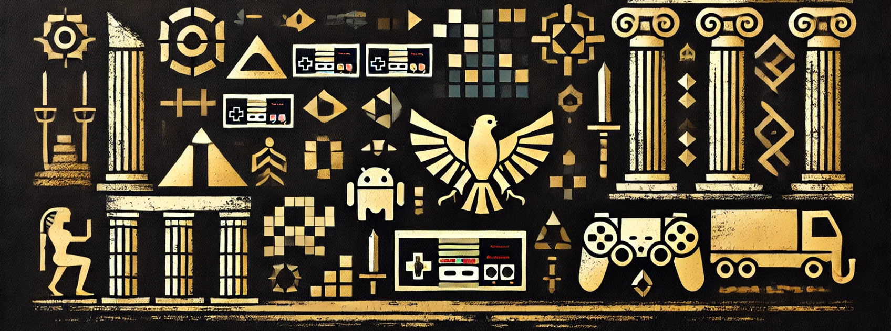

<!-- Banner Image -->
<p align="center">
  
</p>

<!-- Project Title -->
<h1 align="center">🎮 Games Made with AI</h1>

<!-- Shield Icons -->
<p align="center">
  <a href="https://github.com/HarmonicHemispheres/AI-Built-Games">
    
  </a>
  <a href="https://github.com/HarmonicHemispheres/AI-Built-Games/commits/main">
    
  </a>
  <a href="https://openai.com/">
    
  </a>
  <a href="https://openai.com/">
    
  </a>
</p>

<!-- Project Description -->
<p align="center">
  All the games in this project are made entirely with AI products like OpenAI's GPT-4o, o1 and o1-mini. 
  The process involves using a chat interface like ChatGPT to generate and update the games content. 
  After the primary content is generated, then I go into the code and update and add small elements i want changed, mostly variable values.
</p>

<!-- Table of Contents -->
## Table of Contents
- [Games](#games)
    - [🎲 3D Maze Runner](#-3d-maze-runner)
    - [🏰 Tower Defense Example](#-tower-defense-example)
    - [💰 Economy IDLE](#-economy-idle)
    - [📝 Wordl](#-wordl)
    - [✨ Something Fancy!](#-something-fancy)
  - [Contributing](#contributing)
  - [License](#license)
  - [Contact](#contact)

<br>
<br>

<!-- Games Section -->
# Games

### 🎲 3D Maze Runner
**Description:**  
Navigate through intricate 3D mazes generated by AI algorithms. Challenge your spatial awareness and problem-solving skills in an ever-evolving maze environment.

**Features:**
- Procedurally generated mazes
- Multiple difficulty levels
- Smooth 3D graphics powered by AI enhancements

**Links:**
- [Play Now](./games/3d_maze/game.html)
- [Game Info](./games/3d_maze/release_notes.html)

---

### 🏰 Tower Defense Example
**Description:**  
Defend your territory against waves of enemies using strategically placed towers. AI-driven enemy paths and behaviors provide a dynamic challenge every time you play.

**Features:**
- Variety of towers with unique abilities
- AI-controlled enemy units
- Upgrade system for towers

**Links:**
- [Play Now](./games/tower_def_1/game.html)
- [Game Info](./games/tower_def_1/release_notes.html)

---

### 💰 Economy IDLE
**Description:**  
Build and manage your virtual economy with the help of AI. Automate processes, invest wisely, and watch your empire grow in this engaging idle game.

**Features:**
- AI-assisted economic strategies
- Multiple industries to manage
- Real-time progress tracking

**Links:**
- [Play Now](./games/economy_idle/index.html)
- [Game Info](./games/economy_idle/release_notes.html)

---

### 📝 Wordl
**Description:**  
A word puzzle game enhanced by AI to provide personalized challenges. Improve your vocabulary and cognitive skills while having fun.

**Features:**
- AI-generated puzzles tailored to your skill level
- Daily challenges and rewards
- Interactive and user-friendly interface

**Links:**
- [Play Now](./games/wordl/index.html)
- [Game Info](./games/wordl/release_notes.html)

---

### ✨ Something Fancy!
**Description:**  
Stay tuned for our upcoming game! Powered by AI, it's set to deliver an unparalleled gaming experience.

**Features:**
- Cutting-edge AI integration
- Unique gameplay mechanics
- Immersive graphics and sound

**Links:**
- [Open](./templates/under_development.html)

<br>
<br>


<!-- Contributing -->
## Contributing

Contributions are what make the open-source community such an amazing place to learn, inspire, and create. Any contributions you make are **greatly appreciated**.

1. **Fork the Project**
2. **Create your Feature Branch**
   ```bash
   git checkout -b feature/AmazingFeature
   ```
3. **Commit your Changes**
   ```bash
   git commit -m 'Add some AmazingFeature'
   ```
4. **Push to the Branch**
   ```bash
   git push origin feature/AmazingFeature
   ```
5. **Open a Pull Request**

<br>

<!-- License -->
## License

Distributed under the MIT License. See `LICENSE` for more information.

<br>

<!-- Contact -->
## Contact

Robby Boney - [@raenborn](https://x.com/raenborn)

Project Link: [https://github.com/HarmonicHemispheres/AI-Built-Games](https://github.com/HarmonicHemispheres/AI-Built-Games)

