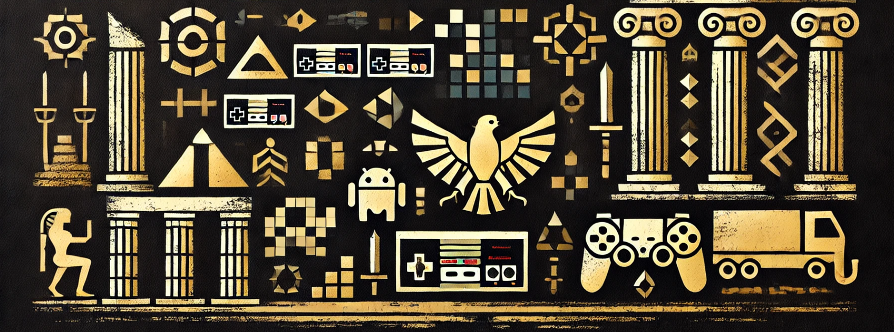

<!-- Banner Image -->
<p align="center">
  
</p>

<!-- Project Title -->
<h1 align="center">🎮 Games Made with AI</h1>

<!-- Shield Icons -->
<p align="center">
  <a href="https://github.com/HarmonicHemispheres/AI-Built-Games">
    
  </a>
  <a href="https://github.com/HarmonicHemispheres/AI-Built-Games/commits/main">
    
  </a>
  <a href="https://openai.com/">
    
  </a>
  <a href="https://openai.com/">
    
  </a>
</p>

<!-- Project Description -->
<p align="center">
  All the games in this project are made entirely with AI products like OpenAI's GPT-4o, o1 and o1-mini. 
  The process involves using a chat interface like ChatGPT to generate and update the games content. 
  After the primary content is generated, then I go into the code and update and add small elements i want changed, mostly variable values.
</p>

## Website Frontend Overhaul (Astro)

The main website shell is now powered by Astro with a neo-brutalist design system.
Existing game content and links are preserved and auto-synced to Astro's public directory.

### Commands

```bash
npm install
npm run dev
npm run build
```

The `sync:legacy-assets` step runs automatically before `dev` and `build`.
It copies `games/`, `templates/`, and shared banner assets into `public/` so links like `./games/...` still work.

### Deploying To GitHub Pages

This repo is now configured for GitHub Pages project-site deployment at:

```text
https://harmonichemispheres.github.io/AI-Built-Games/
```

Build and publish flow:

```bash
npm install
npm run build
git add .
git commit -m "Deploy new Astro site"
git push origin main
```

On push to `main`, GitHub Actions runs `.github/workflows/deploy-pages.yml`, builds the Astro site, and deploys `dist/` to Pages.

One-time GitHub setup:

1. Open the repository on GitHub.
2. Go to `Settings -> Pages`.
3. Under `Source`, select `GitHub Actions`.

After that, each push to `main` replaces the live Pages site with the latest build.

### Per-game `meta.yaml`

Each game folder may contain a `meta.yaml` describing the game. The site reads
every `games/*/meta.yaml` at build time and overlays the values onto the catalog
entry that shares the same `slug`. Anything you set in `meta.yaml` wins over the
static defaults in `src/data/games.ts`, and a fully-described `meta.yaml` can
add a brand-new game with no code changes.

Full example (`games/merchant_seas/meta.yaml`):

```yaml
# Identity
slug: merchant-seas                        # matches the catalog slug used in URLs
title: Merchants of the High Seas
tagline: Sail, trade, and battle across a procedurally generated nautical world.
description: |
  Multi-line "about" copy for the detail page.
  Captain a sloop, brig, frigate, galleon, or man-o'-war on a seeded sea.

# Categorization
category: Strategy
tags:
  - trading
  - naval
  - exploration
featured: true                             # surfaces in the "Featured Drops" row
status: released                           # released | wip | prototype | archived

# Provenance
created: 2026-04-15                        # ISO date the game was first added
updated: 2026-04-25                        # ISO date of the last meaningful change
version: 0.1.0
built_with:
  provider: anthropic                      # anthropic | openai | google | xai | ...
  model: Claude Opus 4.7                   # shown on every card as "Built with <model>"
chat_url: https://...                      # optional link to the AI conversation

# Assets (paths are relative to this game's folder)
entry: merchant_seas.html                  # the HTML file the "Play" button opens
banner: merchant_seas-banner.png           # card / detail banner image
info_url:                                  # optional external info or release-notes URL

# Player-facing content
features:
  - Procedurally generated sea map with seeded RNG
  - Five ship classes with distinct stats and cargo
  - Seasonal market shifts that reroll port specialties

controls:
  - WASD or arrow keys to sail
  - Click a port to dock and trade
  - Spacebar to fire cannons
```

Field reference:

| Field | Purpose |
|-------|---------|
| `slug` | Catalog slug; must match the entry in `src/data/games.ts` if one exists. |
| `title`, `tagline`, `description` | Short title, one-line hook, and longer about-copy. |
| `category`, `tags`, `featured` | Drives the catalog filters and the featured row. |
| `status`, `version`, `created`, `updated` | Provenance shown on the detail page. |
| `built_with.provider`, `built_with.model` | The provider and model that generated the game. `model` is rendered on every card. |
| `chat_url` | Optional link to the AI chat session that produced the game. |
| `entry`, `banner`, `info_url` | Asset paths (relative to the game folder) plus optional external info link. |
| `features`, `controls` | Bullet lists rendered on the detail page when present. |

<!-- Table of Contents -->
## Table of Contents
- [Games](#games)
    - [🎲 3D Maze Runner](#-3d-maze-runner)
    - [🏰 Tower Defense Example](#-tower-defense-example)
    - [💰 Economy IDLE](#-economy-idle)
    - [📝 Wordl](#-wordl)
    - [✨ Something Fancy!](#-something-fancy)
  - [Contributing](#contributing)
  - [License](#license)
  - [Contact](#contact)

<br>
<br>

<!-- Games Section -->
# Games

### 🎲 3D Maze Runner
**Description:**  
Navigate through intricate 3D mazes generated by AI algorithms. Challenge your spatial awareness and problem-solving skills in an ever-evolving maze environment.

**Features:**
- Procedurally generated mazes
- Multiple difficulty levels
- Smooth 3D graphics powered by AI enhancements

**Links:**
- [Play Now](./games/3d_maze/game.html)
- [Game Info](./games/3d_maze/release_notes.html)

---

### 🏰 Tower Defense Example
**Description:**  
Defend your territory against waves of enemies using strategically placed towers. AI-driven enemy paths and behaviors provide a dynamic challenge every time you play.

**Features:**
- Variety of towers with unique abilities
- AI-controlled enemy units
- Upgrade system for towers

**Links:**
- [Play Now](./games/tower_def_1/game.html)
- [Game Info](./games/tower_def_1/release_notes.html)

---

### 💰 Economy IDLE
**Description:**  
Build and manage your virtual economy with the help of AI. Automate processes, invest wisely, and watch your empire grow in this engaging idle game.

**Features:**
- AI-assisted economic strategies
- Multiple industries to manage
- Real-time progress tracking

**Links:**
- [Play Now](./games/economy_idle/index.html)
- [Game Info](./games/economy_idle/release_notes.html)

---

### 📝 Wordl
**Description:**  
A word puzzle game enhanced by AI to provide personalized challenges. Improve your vocabulary and cognitive skills while having fun.

**Features:**
- AI-generated puzzles tailored to your skill level
- Daily challenges and rewards
- Interactive and user-friendly interface

**Links:**
- [Play Now](./games/wordl/index.html)
- [Game Info](./games/wordl/release_notes.html)

---

### ✨ Something Fancy!
**Description:**  
Stay tuned for our upcoming game! Powered by AI, it's set to deliver an unparalleled gaming experience.

**Features:**
- Cutting-edge AI integration
- Unique gameplay mechanics
- Immersive graphics and sound

**Links:**
- [Open](./templates/under_development.html)

<br>
<br>


<!-- Contributing -->
## Contributing

Contributions are what make the open-source community such an amazing place to learn, inspire, and create. Any contributions you make are **greatly appreciated**.

1. **Fork the Project**
2. **Create your Feature Branch**
   ```bash
   git checkout -b feature/AmazingFeature
   ```
3. **Commit your Changes**
   ```bash
   git commit -m 'Add some AmazingFeature'
   ```
4. **Push to the Branch**
   ```bash
   git push origin feature/AmazingFeature
   ```
5. **Open a Pull Request**

<br>

<!-- License -->
## License

Distributed under the MIT License. See `LICENSE` for more information.

<br>

<!-- Contact -->
## Contact

Robby Boney - [@raenborn](https://x.com/raenborn)

Project Link: [https://github.com/HarmonicHemispheres/AI-Built-Games](https://github.com/HarmonicHemispheres/AI-Built-Games)

